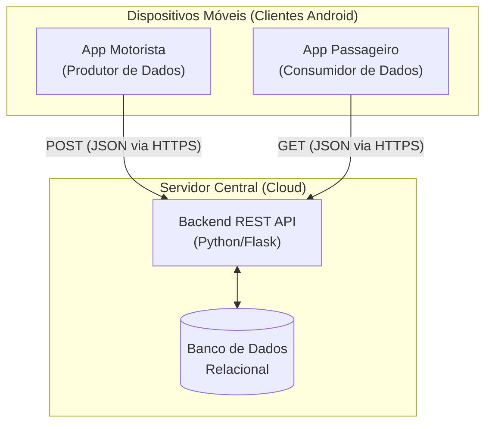
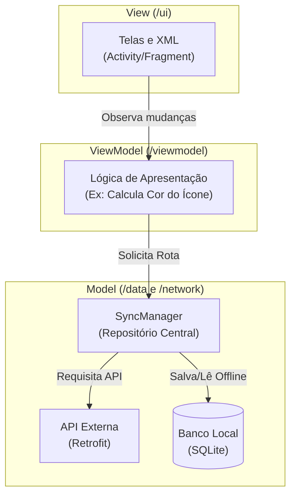
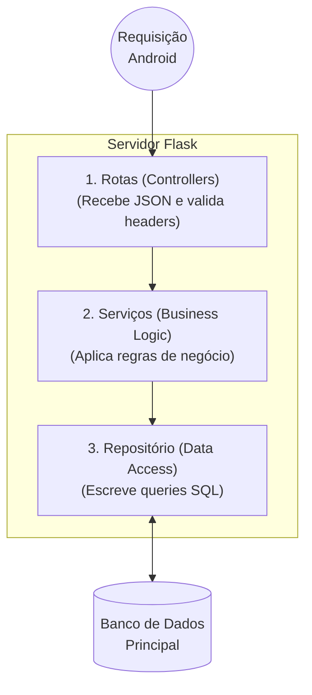

# Descrição da Arquitetura do Sistema de Rastreamento de Ônibus

Este documento descreve as decisões arquiteturais, estruturais e tecnológicas do Sistema de Rastreamento de Ônibus de Bagé/RS. O objetivo é garantir um sistema resiliente, escalável e de fácil manutenção pela equipe.

---

## 1. Padrões Escolhidos e Stack Tecnológica

Para atender aos requisitos não funcionais de resiliência e performance, o sistema adota a seguinte stack tecnológica base:

* **Frontend (Mobile):** Desenvolvimento Nativo Android em **Java**.
* **Arquitetura Frontend:** Padrão **MVVM** (Model-View-ViewModel) para separação de responsabilidades.
* **Persistência Local (Offline):** **SQLite** nativo do Android.
* **Comunicação de Rede:** Biblioteca **Retrofit** (para requisições HTTP REST).
* **Backend (Servidor):** **Python** utilizando o microframework **Flask**.
* **Macroarquitetura:** **Cliente-Servidor**, operando através de uma API RESTful utilizando o formato JSON.

---

## 2. Macroarquitetura: Diagrama de Implantação

Este diagrama ilustra a visão geral do sistema, detalhando onde os componentes são executados fisicamente (dispositivos vs. nuvem) e como se comunicam através da rede.

---

## 3. Microarquitetura Frontend (Android): Padrão MVVM

Este diagrama detalha a organização interna das camadas lógicas do aplicativo Android (/ui, /viewmodel, /data), garantindo que a interface gráfica fique isolada das operações de banco de dados e rede.

---

## 4. Microarquitetura Backend: Padrão em Camadas

Este diagrama demonstra o fluxo de processamento de uma requisição no servidor Python. A separação garante que a validação, as regras de negócio e as consultas SQL não se misturem no mesmo arquivo.

